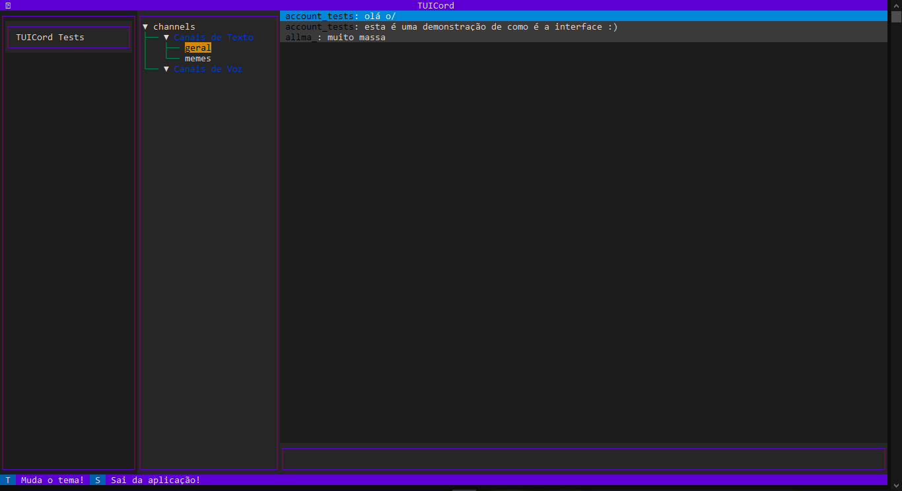

<h1 align="center">TUICord</h1>

[](https://opensource.org/licenses/MIT)
[](https://www.python.org/downloads/release/python-390/)

TUICord is a TUI(Text-based user interface) created to run a discord client
directly by your terminal.



## :sparkles: Resources

- Easily access to Discord from your terminal.
- Sending and receiving text messages.
- Simple and intuitive user interface

---

## 💻 Installation

First of all, you need clone this repo into you system:

````bash
git clone https://github.com/Robert-Nogueira/TUICord.git
````

Now you need install the source as a package in your system,
you can make it using pip, a python package manager.

````bash
pip install --user ./TUICord
````

But I sincerely recommend you use pipx,
this will ensure a clean and isolated installation.

````bash
pipx install ./TUICord
````

Certifique-se de ter o Python 3.9 ou acima instalado

Make sure you have a Python 3.9 or above and pip (or pipx) installed.
___

## 😎 Basic Use

Para iniciar o TUICord, basta executar o seguinte comando no terminal:
to start TUICord, just type the command bellow in your console:

````bash
tuicord run --token Your_ACCOUNT_TOKEN_HERE
````

Another option is to set a environment variable called DISCORD_TOKEN with your
Discord token. After setting this variable, simply execute the command below,
and TUICord will automatically use the provided token, eliminating the need to
pass the token every time you want to run it:

````bash
tuicord run
````

## ❔ How define the environment variable:

### :window: Windows:

Open the Start Menu and search for 'Environment Variables' and click on 'Edit
the system environment variables'.
In the window that opens, click on the 'Environment Variables' button at the
bottom right.
In the 'System Variables' section, click on 'New'.
Type 'DISCORD_TOKEN' in the 'Variable name' field.
Enter your Discord token in the 'Variable value' field.
Click 'OK' to save the variable.

Alternatively, you can simply open the terminal and use the command setx
DISCORD_TOKEN "YOUR_TOKEN_HERE".

### :penguin: Any Linux distro:

In the terminal, type the following command to set the environment variable
temporarily:

````bash
export DISCORD_TOKEN=YOUR_TOKEN_HERE
````

To make this setting permanent, you can add the above command to your profile
file, such as `~/.bashrc`, `~/.bash_profile`, `~/.zshrc`, or another
appropriate file
according to your shell configuration.

After setting the system variable or passing the token as a parameter, TUICord
will be ready for use!

## :warning: Important Note!

Please keep in mind that the Discord token is a sensitive and confidential
authentication credential. Do not share the token with anyone you do not fully
trust.
---

## 👨‍💻 Contributing

Contributions are welcome! If you would like to contribute to this project,
please follow the steps below:

- Fork this repository to your own account.
- Create a branch for your feature or fix: `git checkout -b my-feature`
- Use the `poetry install .` command to install all needed dependencies (you
  need to have poetry installed).
- Make the desired changes and add
  commits: `git commit -m 'Adding new feature'`
- You need to use the `task lint` command before each commit to maintain the
  standardization of clean and readable code.
- To run the program use `poetry run tuicord`.
- Push the changes to the repository on GitHub: `git push origin my-feature`
- Open a Pull Request so we can review your changes.

---

## :scroll: License

This project is licensed under the MIT License - see the LICENSE file for more
details.
